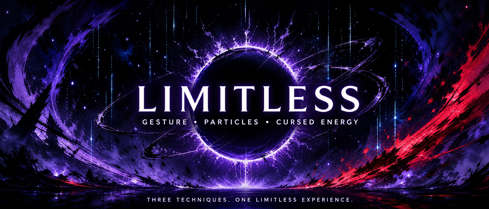

<div align="center">  <p align="center">
<a href="https://legend-1s-here.github.io/Limitless/">
    
  </a>
</p> 


A gesture-driven particle experiment inspired by cursed techniques

<p>
Move your hands. Trigger a technique. Bend the particles to your will.
</p> </div> <h2 align="center">⚡ The Concept</h2> <p align="center">
<strong>Limitless</strong> turns hand gestures into cinematic, volume-based particle simulations.
  Each gesture unlocks a different cursed technique with its own color, energy signature, and visual behavior.
</p> <p align="center">
  
  
  
</p> <h2 align="center">🌀 The Three Techniques</h2> <h3 align="center">🟣 Secret Technique — Hollow Purple</h3> <p align="center">

  
</p> <p align="center">
  A chaotic singularity born from opposing forces. Attraction and repulsion collide inside a turbulent particle vortex, creating an unstable field of violet energy.
</p> <p align="center"><strong>Trigger:</strong> <code>Pinch</code> — touch your thumb and index finger together.</p> <div align="center">

THUMB ───────── INDEX → PINCH → HOLLOW PURPLE

</div> <h3 align="center">🌌 Domain Expansion — Infinite Void</h3> <p align="center">

  
</p> <p align="center">
  A multi-layered celestial domain with a radiant event-horizon ring, a vertical stream of infinite information, and a deep cosmic background that stretches beyond perception.
</p> <p align="center"><strong>Trigger:</strong> <code>Cross</code> — cross your index and middle fingers.</p> <div align="center">

INDEX ╳ MIDDLE → CROSS → INFINITE VOID

</div> <h3 align="center">🔴 Cursed Technique Reversal — Red</h3> <p align="center">

  
</p> <p align="center">
  A blinding, white-hot core that erupts into a violent jagged sphere of repulsive force. Focused energy becomes explosive motion.
</p> <p align="center"><strong>Trigger:</strong> <code>Point Up</code> — raise your index finger toward the sky.</p> <div align="center">

INDEX ↑ → POINT UP → RED

</div> <h2 align="center">🎮 Gesture Matrix</h2> <div align="center">

GestureTechniqueEnergy SignatureVisual Mood🤏 PinchHollow PurpleAttraction + RepulsionChaotic / Violet🤞 CrossInfinite VoidInfinite InformationCosmic / Cyan☝️ Point UpRedRepulsive ForceViolent / Crimson

</div> <h2 align="center">🎨 Color Language</h2> <p align="center">

  
  
</p> <p align="center">
  Every technique has a distinct particle language: violet turbulence for contradiction, cyan depth for infinity, and red impact for pure repulsion.
</p> <h2 align="center">✨ The Experience</h2> <div align="center">

Plain Text

```
    READ THE GESTURE
          │
          ▼
  SELECT THE TECHNIQUE
          │
          ▼
   SUMMON THE PARTICLES
          │
          ▼
   BREAK THE LIMITLESS
```


 </div> <h2 align="center">🚀 Quick Start</h2> <p align="center">
Clone the project, launch the experience, and place your hands in front of the camera. The particles are waiting.
</p>

Bash

git clone [https://github.com/Legend-1s-here/Limitless.git](https://github.com/Legend-1s-here/Limitless.git)cd Limitless


<div align="center">

Limitless

Three gestures. Three techniques. One limitless experience.


 </div>

